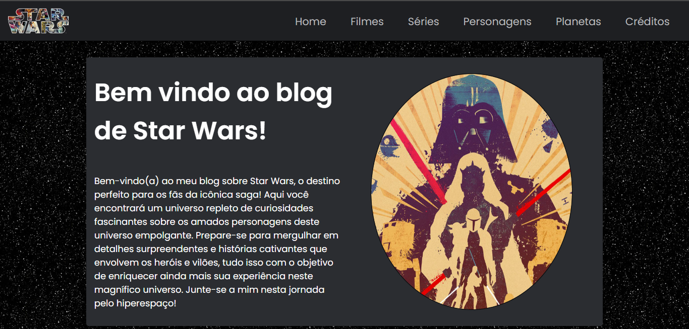

# Projeto final da matéria de Linguagem de Marcação e Formatação.

## Resumo:

- Avaliação de fim de período da matéria de Linguagem de Marcação e Formatação lecionada pelo professor Mayrton Dias no curso de Análise e Desenvolvimento de Sistemas da Faculdade Católica Imaculada Conceição do Recife. A atividade contém os conhecimentos práticos em HTML e CSS aquiridos em sala. É um blog sobre Star Wars contendo seções que contam curiosidades sobre filmes, séries, personagens e planetas da saga.

     

## Tecnologias utilizadas: 

- HTML
- CSS

## Links importantes:

- [CLIQUE AQUI PARA VISUALIZAR O PROJETO](https://arthurgab03.github.io/projeto-html-ficr-ads/index.html)

